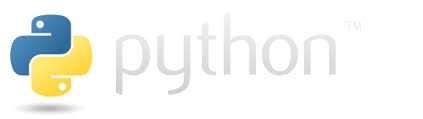

    

## PROFESSIONAL SUMMARY:
*  Over **6+ years** of experience in Analysis, Design, Development, Management and Implementation of various stand-alone, client-server enterprise applications.
*  Experience in multi-tiered distributed environment, **OOAD concepts**, good understanding of Software Development Lifecycle (SDLC).
*  Strong experience of software development in **Python** (libraries used: **Beautiful Soup, numpy, scipy, matplotlib, Python-twitter, Pandas dataframe, networkx, urllib2, MySQLdb for database connectivity)** and IDEs – **sublime text and Pycharm**.
*  Experience in developing web applications by following Model View Control (MVC) Architecture using server side application **Django**.
*  Experience in working with Python ORM Libraries including **Django ORM**.
*  Experience in using **Design Patterns** such as **MVC, Singleton** and frameworks such as **DJANGO**.
*  Experience with several Python packages like **Numpy, Matplotlib, Scipy, PyQt, wxpython and PyTables**.
*  Very good experience with cloud platforms like **Amazon AWS**.
*  Knowledge about setting up **Python REST API** Frame work using **Django**.
*  Experience in Web Application Development, hands on experience of **Python/Django, Flask, SQL Alchemy, SQLite, JavaScript, JQuery, HTML5/CSS3, Bootstrap** and **JSON/AJAX**.
*  Experienced in working with various **Python IDE's** using **PyCharm, PyScripter, Spyder, PyStudio**, and **PyDev**.
*  Having experienced in **Agile Methodologies, Scrum** stories and sprints experience in a **Python** based environment, along with data analytics, data wrangling and Excel data extracts.

## TECHNICAL SKILLS:
| **Category**         | **Skills/Technologies**                                                                                     |
|----------------------|-------------------------------------------------------------------------------------------------------------|
| **Languages**        | Python, Shell Script, SQL, PHP                                                                              |
| **Frameworks/Tools** | Flask, Django, Beautiful Soup, Pandas, PyUnit, PyQuery, Wireshark, NumPy, SciPy, Matplotlib, Webapp2        |
| **Databases**        | MS SQL, MySQL, Oracle                                                                                       |
| **Web Technologies** | XML, CSS, HTML, DHTML, JavaScript, JQuery, MVC3, Bootstrap, RESTful, AJAX, Node.js                          |
| **Web Services**     | SOAP, REST                                                                                                  |
| **Tools & IDEs**     | Eclipse, PyDev, PyCharm, PyScripter, Spyder, PyStudio                                                       |
| **Methodologies**    | Agile, Scrum                                                                                                |
| **Operating Systems**| Windows, Linux                                                                                              |
---
## PROFESSIONAL EXPERIENCE:
**Client: WorkSafe BC, Vancouver, BC.** 
**Duration: Jan 2018 – Till Date** 
**Role: Python Developer** 
**Environment:** Python, Django, PyUnit, PyQuery, XML, JSON, HTML, Wireshark, Pandas, REST, AWS, Node.js, Bootstrap, CSS, JQuery, MySQL, Agile and Linux. 
**Responsibilities:** 
*  Responsible for gathering requirements, system analysis, design, development, testing and deployment.
*  Developed views and templates with **Python and Django's** view controller and templating language to create a user-friendly website interface.
*  Responsible for designing and developing **REST** web services in **Python** using **Flask and flask-restful** framework
*  Developed views and templates with **Python** and **Django's** view controller and templating language to create a user-friendly website interface. Used **PyQuery** for selecting particular DOM elements when parsing **HTML**.
*  Used **Wireshark**, live http headers, and **Fiddler2** debugging proxy to debug the **Flash object** and help the developer create a functional component.
*  Used **Pandas** library for statistical Analysis.
*  Worked with **JSON** based **REST Web services** and **Amazon Web services (AWS)**.
*  Involved in AJAX driven application by invoking **web services/API** and parsing the **JSON** response.
*  Developed internal auxiliary web apps using **Python Flask** framework with **JavaScript** and **Bootstrap, CSS/HTML framework**.
*  Used **Python Library Beautiful Soup** for Web Scraping to extract data for building graphs
*  Wrote **Python** modules to extract/load asset data from the **MySQL** source database.
*  Utilize **PyUnit**, the **Python** unit test framework, for all **Python** applications.
*  Developed web applications and **RESTful web services** and **APIs** using **Python, Django and Flask**.
*  Involved in **Agile** Methodologies, Scrum stories and sprints experience in a **Python** based environment, along with data analytics, data wrangling and Excel data extracts.
---
**Client: Shaw Communications - Calgary, AB.** 
**Duration: Nov 2016 – Dec 2017** 
**Role: Python Developer** 
**Environment:** Python, Django, Beautiful soup, matplotlib, Scipy, Numpy, Node.js, XML, PyQt, PyUnit, webapp2, GitHub, Pandas, MySQL, REST, JSON, PostgreSQL, Oracle, PL/SQL, HTML, XHTML, AJAX, CSS, JavaScript, Jira and Agile. 
**Responsibilities:** 
*  Involved in building database Model, APIs and Views utilizing **Python**, in order to build an interactive web based solution.
*  Worked on server-side applications with Django using Python programming and used **Python libraries** like **Beautiful Soup, Matplotlib, SciPy, NumPy** and built efficient **Node.js** backend for client web application.
*  Developed tools to automate some base tasks using **Python, Shell scripting and XML**. Used **PyQt** to implement GUI for the user to create, modify and view reports based on client data.
*  Developed GUI using **Webapp2** for dynamically displaying the test block documentation and other features of python code using a web browser.
*  Developed **Python** based **API (RESTful Web Services)** to track the events and perform analysis using **Django**.
*  Used **GitHub** for version control.
*  Managed large datasets using **Panda** data frames and **MySQL**.
*  Involved in development of Python based Web Services using **REST** for sending and getting data from the external interface in the **JSON** format and perform analysis using **Django and PostgreSQL**.
*  Designed and developed the **UI** of the website using **HTML, XHTML, AJAX, CSS** and **JavaScript**.
*  Utilized **Agile** process and **JIRA** issue management to track sprint cycles.
*  Created **PyUnit** test cases for unit testing.
*  Developed **SQL Queries, Stored Procedures,** and **Triggers** Using **Oracle, SQL and PL/SQL**.
---
**Client: Discovery Air, Etobicoke, ON.** 
**Duration: Oct 2015 – Oct 2016** 
**Role: Python Developer** 
**Environment:** Python, Django, Pandas, XML, XHTML, AJAX, CSS, JQuery, GitHub, SQL, Rest API, Jira and Agile. 
**Responsibilities:** 
*  Participated in the development of application architecture and blueprints to define application components, platforms, interfaces and development tools.
*  Used **Django** configuration to manage **URLs** and application parameters.
*  Generated **Python Django** Forms to record data of online users.
*  Used **Python and Django** creating graphics, **XML** processing, data exchange and business logic implementation.
*  Used **Pandas API** to put the data as time series and tabular format for east timestamp data manipulation and retrieval.
*  Created a **Git** repository and added the project to **GitHub**.
*  Wrote **Python scripts** to parse **JSON** documents and load the data in database.
*  Responsible for setting up **Python REST API** framework using **Django**.
*  Used **JQuery** and **Ajax** calls for transmitting **JSON** data objects between frontend and controllers.
*  Utilized **Agile** process and **JIRA** issue management to track sprint cycles.
---
**Client: Mobisys, India.** 
**Duration: Apr 2013 – Sep 2015** 
**Role: Python Developer** 
**Environment:** Python, Django, Flask, PyQt, PyTest, XML, JQuery, HTML, CSS, JavaScript, SOAP, Jira and SQL. 
**Responsibilities:** 
*  Responsible for analyzing various cross-functional, multi-platform applications systems enforcing python, best practices and provide guidance in making long term architectural design decisions.
*  Developed monitoring and notification tools using **Python**.
*  Wrote **Python** routines to log into the websites and fetch data for selected options.
*  Parsed **XML** file using **Python** to extract data from database.
*  Designed and developed a horizontally scalable **APIs** using Python **Flask**.
*  Developed **Python** batch processors to consume and produce various feeds. Developed Merge jobs in **Python** to extract and load data into **MySQL** database.
*  Used **Python and Django** to interface with the **jQuery UI** and manage the storage and deletion of content.
*  Created Data tables utilizing **PyQt** to display patient and policy information and add, delete, update patient records.
*  Wrote and executed various **MYSQL database** queries from Python using **Python-MySQL** connector and MySQL DB package.
*  Involved in development of Web Services using **SOAP** for sending and getting data from the external interface in the XML format.
*  Responsible for debugging the project monitored on **JIRA (Agile)**.
*  Participated in weekly release meetings with Technology stakeholders to identify and migrate potential risks associated with the releases.
---
**Client: NEC Technologies India Limited, India** 
**Duration: Nov 2011 – Mar 2013** 
**Role: Senior Software Engineer/Member Technical Staff** 
**Environment:** Perl, SQL & PLSQL (MySQL) on Linux, Python (Django), HTML5, CSS, JavaScript (jQuery) 
**Responsibilities:** 
*  Created various Server Health reporting tools using Perl on Linux with the data maintained on MySQL database
*  Wrote user manuals, functional and design documents along with unit test cases as part of SDLC process
*  Created tools to perform extensive administration work on Linux servers like creating Excel data report sheets along with graphs and emailing them to Administrators in critical cases
*  Learned Python and its Framework Django for Transport Help Desk project
*  For the Hydrastore project, managed the backend part of the GUI as a part of GUI-base team. Majority of the base code was in Perl and some in bash. Worked primarily on fixing BUGS and enhancements
---
**Client: Oracle India Private Limited, India** 
**Duration: Mar 2007 – Oct 2011** 
**Environment:** Perl’s MVC Framework “Catalyst”, Linux and MySQL, Perl, SQL & PLSQL (MySQL) on Linux, SVN 
**Responsibilities:** 
**Role: Software Engineer/Technical Solutions Engineer, 2010 - 2011**
*  Enhanced internal online application which was installing/removing EPM (Enterprise package manager’s) packages on organization’s Linux servers catering to customer’s requirements. Administrators using the application could monitor the installation progress too

**Role: Software Engineer/Systems Engineer, 2007 - 2010**
*  Worked as production support engineer to a third party Linux authentication and logging tool called PowerBroker from BeyondTrust
*  Administered Powerbroker which had its own policy code. Learned the policy language to write code to manage authentication and control user access to various levels. Managed PB’s session and keystroke logging too
*  Developed an application using Perl to connect to internal hosts database, which carried information of all machines inside company and using database modules run sql query and retrieve specific data in a flatfile subsequently using this data for the authentication tool (PB). These scripts were matching host info and then allowing access
*  Created another script, for the LDAP directory population using Perl’s CPAN Modules of this host info gathered
*  Applied internal security team’s list of security requirement (in an xml file) on all Linux boxes using a Perl application. The application generates a detailed report in an xls sheet and subsequently emailing it to the security team's ML
---
**Client: California Digital India Pvt. Ltd., India** 
**Duration: Jun 2004 – Sep 2006** 
**Role: Software Engineer** 
**Environment:** Linux (BASH, Perl), C, MATLAB, System Imager and Oscar Cluster installation technologies 
**Responsibilities:** 
*  Worked in GE-JFWTC as a service provider, as a part of GE’s HPC Team setting up and maintaining Linux clusters and servers remotely. Wrote Bash and Perl (for automation of various processes) scripts
*  Worked on Image processing and Camera calibration tool project requiring MATLAB code to be converted to C using VXL libraries
---
## EDUCATION:
Bachelor of Engineering, Visveswaraiah Technological University (VTU), India (Evaluated by W.E.S.) **2004**